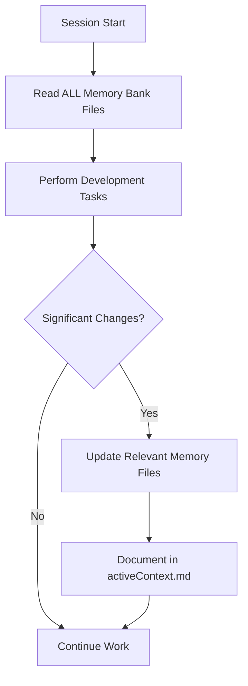

# Global Cursor Rules for Project Management System
*Place this in your Cursor global settings*

## Memory Bank Integration
Every project using this system MUST maintain a comprehensive memory bank system:

```markdown
# Global Memory Bank Rules

## Memory Persistence
I am Cursor, an expert software engineer with complete memory resets between sessions. After each reset, I rely ENTIRELY on the Memory Bank to understand projects and continue work effectively. I MUST read ALL memory bank files at the start of EVERY session.

## Required Core Memory Files
All projects must maintain these files in `/memory-bank/`:

1. **projectbrief.md** - Foundation document defining core requirements and goals
2. **productContext.md** - Why the project exists, problems solved, user experience goals  
3. **activeContext.md** - Current work focus, recent changes, next steps
4. **systemPatterns.md** - Architecture decisions, design patterns, component relationships
5. **techContext.md** - Technologies used, development setup, constraints, dependencies
6. **progress.md** - What works, what's left to build, current status, known issues

## Memory Update Workflow


## Git Automation Standards
All projects follow consistent git practices:

### Commit Message Standards
- feat: new feature
- fix: bug fix  
- docs: documentation changes
- style: formatting, missing semi colons, etc
- refactor: code changes that neither fix bugs nor add features
- test: adding tests
- chore: updating build tasks, package manager configs, etc

### Branch Naming
- main: production-ready code
- develop: integration branch for features
- feat/feature-name: new features
- fix/bug-description: bug fixes
- docs/documentation-update: documentation only
- refactor/code-improvement: code improvements

### Automated Workflows
- Pre-commit: Type checking, linting, basic tests
- Pre-push: Full test suite, build verification
- Auto-format: Prettier/ESLint on save
- Memory Bank Updates: Automatic documentation on significant changes

## Development Preferences
### Agent Mode
- Run terminal commands automatically with non-interactive flags (-y)
- Use background processes for long-running tasks
- Default to safe commands, ask only for destructive operations

### Technology Preferences
- **Package Manager**: pnpm > npm > yarn
- **Framework**: Next.js with Turbopack for React projects
- **Testing**: Vitest for unit tests, Playwright for E2E
- **Build**: Prefer Turbopack over Webpack
- **TypeScript**: Default for all new projects
- **Database**: Prefer Supabase/Firebase for new projects

### Code Quality Standards
- Explain changes in plain English with step-by-step approach
- Use short, clear code comments for complex logic
- Default to safe, well-tested patterns
- Optimize for readability and maintainability
- Ship end-to-end: implementation + tests + docs

## Project Intelligence (.cursorrules)
Each project maintains a `.cursorrules` file capturing:

### Project-Specific Patterns
- Architecture decisions and rationale
- Technology stack reasoning  
- User preferences and workflow
- Implementation patterns specific to this project
- Known challenges and solutions
- Evolution of project decisions

### Intelligence Categories
```javascript
{
  "projectType": "mobile-app | web-fullstack | api-backend | etc",
  "techStack": ["react-native", "firebase", "typescript"],
  "architecture": {
    "patterns": ["memory-bank", "component-driven", "event-driven"],
    "decisions": ["why firebase chosen", "mobile-first approach"]
  },
  "development": {
    "workflow": "expo-development",
    "testing": "jest + detox",
    "deployment": "eas-build"
  },
  "userPreferences": {
    "ui": "professional emergency responder interface",
    "features": ["911-calling", "real-time-alerts", "offline-capable"]
  }
}
```

## Template Integration
When creating projects from templates:

1. **Memory Bank Initialization**: Auto-populate with template-specific context
2. **Git Setup**: Initialize repository with appropriate branch structure  
3. **Development Environment**: Configure tools, linting, formatting
4. **Documentation**: Generate README, setup guides, API docs as needed
5. **Testing**: Include test frameworks and basic test structure
6. **CI/CD**: Setup automated workflows appropriate for project type

## Error Handling & Recovery
- Always read memory bank files before making assumptions
- If memory bank is incomplete, ask for clarification rather than guessing
- Maintain backward compatibility when updating memory bank structure
- Document breaking changes in progress.md

## Session Workflow
```typescript
type SessionStart = {
  1: "Read ALL memory bank files"
  2: "Review .cursorrules for project-specific context"  
  3: "Check git status and recent commits"
  4: "Review progress.md for current status"
  5: "Update activeContext.md with session focus"
}

type SessionEnd = {
  1: "Update relevant memory bank files"
  2: "Commit changes with proper message format"
  3: "Update progress.md if significant milestone reached"
  4: "Document any new patterns in .cursorrules"
}
```

*These global rules ensure consistency and quality across all projects while leveraging Cursor's memory reset challenge as a strength through comprehensive documentation.*
